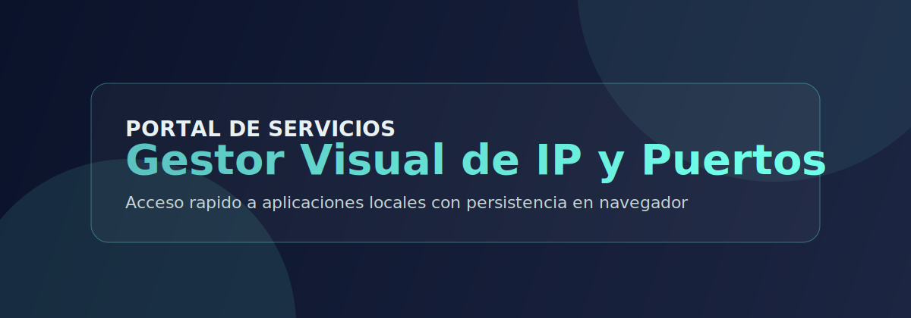
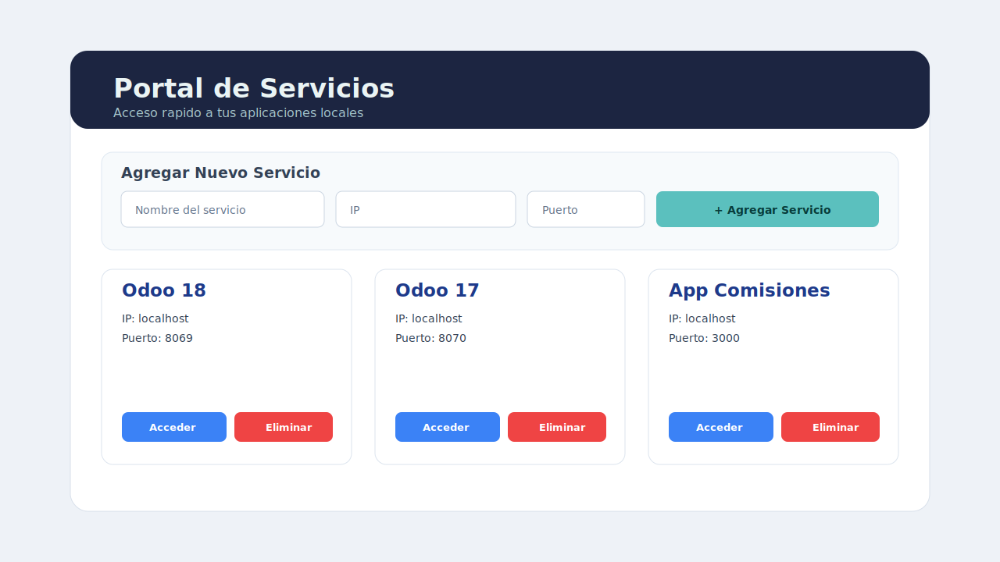

# 🌐 Portal de Servicios

### Gestor web para centralizar accesos por IP y puerto a tus aplicaciones locales




---

## 📋 Descripcion

Aplicacion web ligera para registrar, visualizar y abrir rapidamente servicios internos usando combinaciones de **nombre + IP + puerto**.

Esta pensada para entornos donde se manejan varias aplicaciones locales (por ejemplo Odoo, apps internas o dashboards) y se necesita acceso rapido desde un unico panel.

---

## ✨ Funcionalidades principales

| Funcionalidad | Detalle |
|---|---|
| ➕ Registro de servicios | Crea servicios con nombre, IP y puerto |
| 💾 Persistencia local | Guarda datos automaticamente en `localStorage` |
| 🚀 Acceso directo | Abre cada servicio en una nueva pestana |
| 🧹 Limpieza rapida | Elimina servicios con confirmacion |
| 🔐 Escape HTML | Sanitiza texto para evitar inyecciones |
| 📱 Responsive | Vista adaptable para escritorio y movil |

---

## 🖼️ Vista de la interfaz



---

## 🧱 Estructura del proyecto

```text
proyecto/
├── index.html
├── script.js
├── styles.css
└── docs/
    └── img/
        ├── hero.svg
        └── preview.svg
```

---

## ⚙️ Flujo funcional

1. La aplicacion carga servicios de `localStorage` al iniciar.
2. Si no hay datos, inserta una lista base por defecto.
3. El formulario valida campos obligatorios y rango de puerto (1 a 65535).
4. Se renderizan tarjetas con acciones de acceso y eliminacion.
5. Los cambios quedan persistidos para futuras sesiones.

---

## 🚀 Ejecucion

### Opcion 1: abrir directamente

Abre `index.html` en el navegador.

### Opcion 2: servidor local recomendado

```bash
cd /home/proyecto
python3 -m http.server 8080 --bind 0.0.0.0
```

Luego abre:

```text
http://localhost:8080
```

---

## 🧪 Datos iniciales cargados

La app arranca con estos servicios por defecto:

- `Odoo 18` en `localhost:8069`
- `Odoo 17` en `localhost:8070`
- `App Comisiones` en `localhost:3000`

---

## 🔒 Validaciones implementadas

- Nombre obligatorio
- IP obligatoria
- Puerto obligatorio
- Puerto numerico entre `1` y `65535`
- Confirmacion antes de eliminar
- Escape de texto para render seguro

---

## 🛠️ Tecnologias

- HTML5
- CSS3 (layout responsive con grid)
- JavaScript Vanilla (sin dependencias)
- Web Storage API (`localStorage`)

---

## 📌 Proximas mejoras sugeridas

- Edicion de servicios existentes
- Busqueda y filtros por nombre/IP
- Selector de protocolo (`http/https`)
- Exportacion e importacion de configuraciones
- Verificacion de disponibilidad del servicio

---

## 👨‍💻 Autor

**Yerson Vargas Vargas**

Desarrollo y soporte de herramientas internas.

[](https://github.com/Yerson-0912)
[](mailto:yervargas6@gmail.com)
